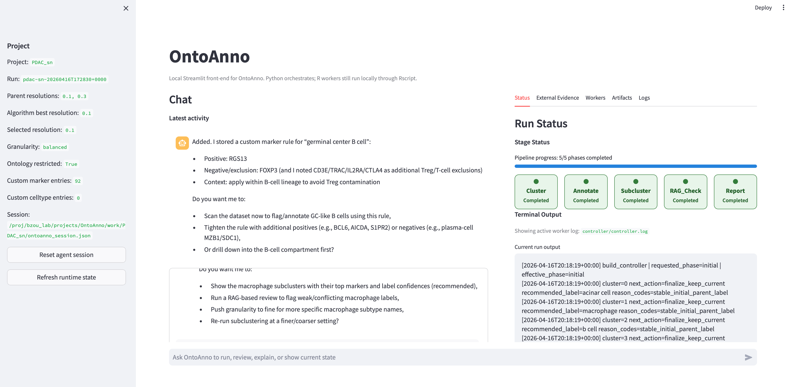

# OntoAnno

Ontology-aware single-cell annotation with an agent-guided web interface.

OntoAnno helps researchers annotate Seurat single-cell datasets, review labels
with marker and ontology evidence, inspect subclusters, and generate a final
HTML report. The main interface is a local Streamlit app: users interact with
the agent in natural language while Python coordinates R/GPTAnno workers in the
background.



## Quick Start

Clone the repository:

```bash
git clone https://github.com/tamuya23/OntoAnno.git
cd OntoAnno
```

Use Docker on a laptop, workstation, or regular Linux server:

```bash
bash scripts/docker_setup.sh
export OPENAI_API_KEY=your_api_key_here
# put your Seurat .rds file under data/
# edit configs/demo.yaml for your dataset
./scripts/start_ontoanno_docker.sh configs/demo.yaml
```

Use Apptainer on HPC systems where Docker is not available:

```bash
bash scripts/apptainer_setup.sh
export OPENAI_API_KEY=your_api_key_here
# put your Seurat .rds file under data/
# edit configs/demo.yaml for your dataset
./scripts/start_ontoanno_apptainer.sh configs/demo.yaml
```

Then open the URL printed in the terminal, usually:

```text
http://127.0.0.1:8501
```

If you are using SSH or HPC, forward port `8501` through VS Code or your SSH
client.

## Configure Your Dataset

Start from `configs/demo.yaml` for a normal first run. Use
`configs/demo_optional.yaml` only when you need optional inputs such as
reference labels, PDF evidence, or precomputed marker genes. The key fields are:

```yaml
project:
  name: MyProject
  work_dir: /work/MyProject

inputs:
  seurat_rds: /data/my_project/my_dataset.rds

annotation:
  species: human
  tissue_name: human pancreatic tumor
  parent_res:
    - 0.1
    - 0.3
```

Put data files under `data/`, then use container paths such as `/data/...` in
the YAML file.

## What OntoAnno Does

- Runs parent clustering and cell-type annotation.
- Selects and tracks parent annotation resolution.
- Supports granularity changes without changing cluster structure.
- Runs subcluster analysis for selected parent cell types.
- Stores user-provided and literature-provided marker evidence.
- Runs RAG-based review against ontology and marker references.
- Supports human review for unresolved clusters.
- Generates a final report with tables, figures, and review summaries.

## Documentation

The main user documentation is in `docs/`:

- [Quick Start](docs/quick_start.rst)
- [Data Configure](docs/data_configure.rst)
- [Agent Guide](docs/agent_guide.rst)

## Acknowledgement

OntoAnno builds on the GPTAnno annotation workflow. For the original GPTAnno
repository, see [GPTAnno](https://github.com/yrsong001/GPTAnno).

## License

License information will be added before release.
