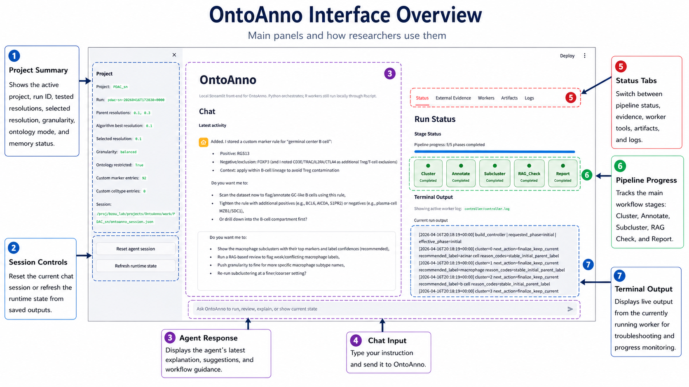

Agent Guide
===========

Use this page after OntoAnno is installed, ``configs/demo.yaml`` is configured,
and the web app opens correctly.

If you have not done those steps yet, start here first:

* :doc:`quick_start`
* :doc:`data_configure`

Panel Introduction
------------------

The OntoAnno page has three main working areas.

.. list-table::
   :header-rows: 1
   :widths: 10 24 42 24

   * - No.
     - Panel
     - What it shows
     - When to use it
   * - 1
     - Project panel
     - Project name, run ID, parent resolutions, selected resolution, granularity, ontology setting, and evidence counts.
     - Check this before running a workflow.
   * - 2
     - Session controls
     - Buttons for resetting the agent session or reloading the saved session from disk.
     - Use only when you want to clear the chat or refresh stale page state.
   * - 3
     - Agent response
     - Agent replies, reasoning summaries, completed actions, suggestions, and follow-up questions.
     - Read this after each request to confirm what OntoAnno did or what it needs next.
   * - 4
     - Chat input
     - Natural-language box for running annotation, review, evidence, subcluster, and report tasks.
     - Type what you want OntoAnno to do.
   * - 5
     - Status tabs
     - Tabs for pipeline status, external evidence, manual workers, artifacts, and logs.
     - Switch panels when monitoring runs, reviewing evidence, or inspecting outputs.
   * - 6
     - Pipeline progress
     - The main workflow stages: Cluster, Annotate, Subcluster, RAG_Check, and Report.
     - Watch this to see which stage has completed or is currently running.
   * - 7
     - Terminal output
     - Live output from the currently running worker.
     - Use this for progress monitoring and troubleshooting failed workers.

Cluster
-------

The cluster module prepares cluster-level marker genes for parent annotation.
It uses the ``parent_res`` values from ``configs/demo.yaml``.

If ``annotation.preprocess`` is ``true``, OntoAnno first runs Seurat
normalization, variable feature selection, scaling, PCA, and UMAP. It then
clusters cells at each parent resolution and finds marker genes for each
cluster.

Typical chat request:

.. code-block:: text

   Run the parent annotation

This request starts the parent workflow, so the cluster module runs first when
cluster outputs are missing.

Check results in:

* ``Status`` for cluster progress and logs.
* ``Artifacts`` for resolution-specific marker and prediction outputs.

Annotation
----------

The annotation module assigns parent cell-type labels to clusters. It uses
cluster marker genes, tissue/species context, ontology settings, and repeated
LLM annotation runs.

Typical chat request:

.. code-block:: text

   Run the parent annotation

After it finishes, ask:

.. code-block:: text

   What is the selected resolution?

Check results in:

* ``Artifacts`` for the parent annotation table.
* ``Artifacts`` for the prediction figure.
* ``Artifacts`` for the resolution score table.

If the selected resolution is not what you want, tell the agent directly:

.. code-block:: text

   Change the resolution to 0.3

Changing resolution changes which cluster assignment is used. It is different
from granularity, which is handled during RAG-based review and label
refinement.

Subcluster
----------

The subcluster module looks deeper into one parent cell type. Use it when a
major parent label is biologically broad or contains multiple expected
subtypes.

Typical chat request:

.. code-block:: text

   Look deeper into macrophages

OntoAnno subsets that parent cell type, reclusters it using ``sub_res``, and
generates subtype annotations.

Check results in:

* ``Status`` for subcluster progress and logs.
* ``Artifacts`` for subcluster annotation tables and figures.

Subclustering is optional. You can skip it and continue directly to RAG review
or report generation.

External Evidence
-----------------

External evidence is project memory that OntoAnno can use later when reviewing
parent or subcluster annotations. You can add it before or after annotation; if
you add it early, OntoAnno stores it and applies it when the RAG review and LLM
judge steps run.

To add marker evidence manually, say the cell type and markers explicitly:

.. code-block:: text

   Add these markers to pericyte: RGS5, CSPG4, MCAM

User-provided marker evidence is treated as high-priority evidence during
review. It can support or challenge parent and subcluster labels during RAG
review, but it does not change clustering, marker-gene detection, or the initial
GPTAnno parent annotation directly. Only add it when the cell type and marker
relationship is explicit.

You can also add literature-derived evidence from a PDF. Open ``External
Evidence`` and use the PDF extraction panel:

1. Upload a literature PDF.
2. Choose the page range for figure extraction.
3. Keep the default render DPI unless the figure text is too small.
4. Click ``Extract PDF evidence``.

OntoAnno extracts text evidence with the GPTAnno/PDF2markers text pipeline and
extracts figure evidence with a vision LLM. The resulting celltype-marker pairs
appear under literature-provided evidence. These PDF-derived entries are
supportive evidence for review, not golden rules.

RAG_Check
---------

The RAG check module reviews annotation consistency using ontology candidates,
reference marker evidence, user-provided evidence, literature-provided
evidence, and LLM comparison.

Granularity belongs to this review stage. It controls how specific the reviewed
label candidates should be after clusters and marker genes are already fixed.
It changes which ontology candidates are compared by the LLM judge; it does not
force the LLM to choose a more specific or more general label. Accuracy remains
the first priority, so the LLM can keep the current label or send the cluster to
human review if the markers do not support the requested specificity.

.. code-block:: text

   The reviewed labels are too coarse. Make them more specific.

Run it after parent annotation or after subclustering:

.. code-block:: text

   Run the RAG check

Check results in:

* ``Artifacts`` for flagged clusters and candidate labels.
* ``Artifacts`` for RAG marker evidence comparisons.
* ``External Evidence`` for stored user and literature evidence.

If OntoAnno reports unresolved clusters, use the manual review controls in the
RAG review panel. This is not a separate annotation algorithm; it is the final
human resolution step for clusters that automated comparison did not safely
finalize. You can also ask the agent to continue with manual review:

.. code-block:: text

   Continue with human review

For each unresolved cluster, choose the final label or enter a custom label.
You can also save a specific decision through chat:

.. code-block:: text

   For cluster 3, label as cardiomyocyte

After the decisions are saved, ask the agent to export the reviewed labels:

.. code-block:: text

   Finish review and export the reviewed annotations

Reference Label Comparison
--------------------------

If you have a CSV with known or manual labels, you can give it to the agent
instead of editing optional YAML fields by hand:

.. code-block:: text

   Compare with /data/project/manual_labels.csv using column celltype

The agent will add the reference-label path and label-column name to the config
and enable optional evaluation.

Report
------

The report module creates the final report after annotation and review. The
default output is HTML. A PDF report is also available when requested.

Typical chat request:

.. code-block:: text

   Generate the final report

To choose a specific format, say it directly:

.. code-block:: text

   Generate a PDF report

.. code-block:: text

   Generate an HTML report

The report summarizes parent annotations, selected resolution, RAG review,
human review decisions, available subcluster results, figures, and output
tables.

Check results in:

* ``Artifacts`` for the report preview.
* ``work/<project>/`` and ``runs/<run_id>/`` for saved output files.
